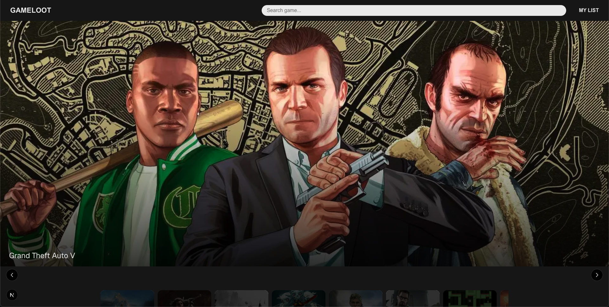
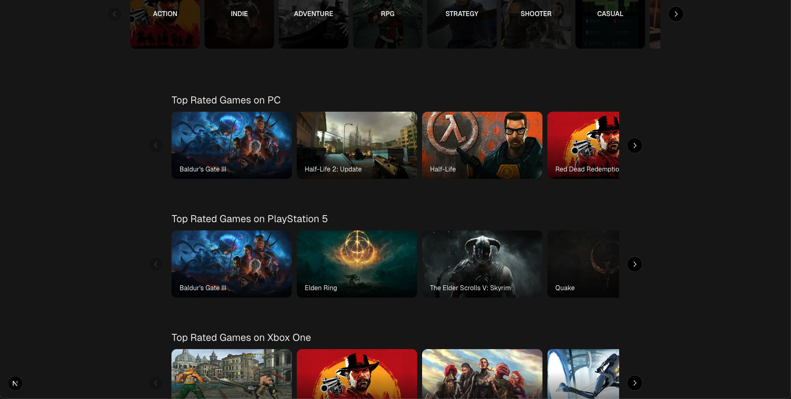
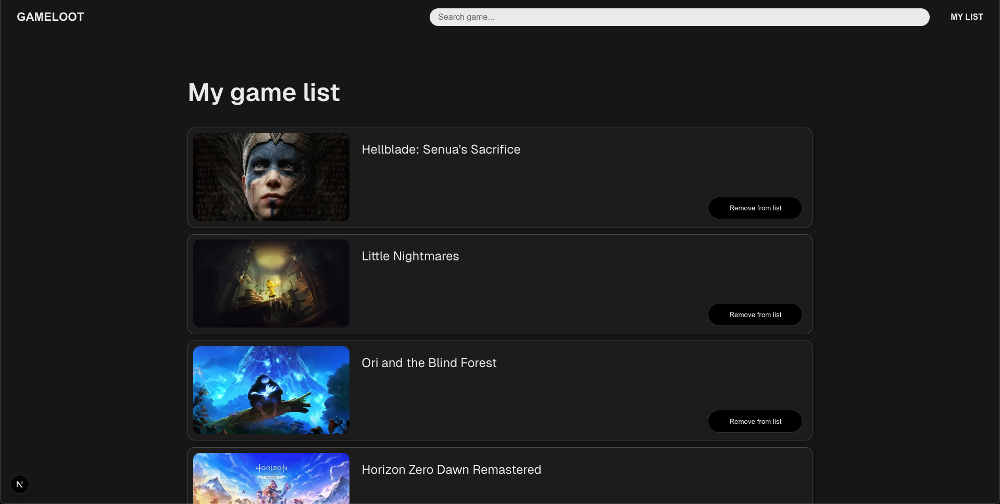

# Individual Project FE24
This portfolio project showcases the skills I have acquired during the Frontend Development course (FE24) at Lexicon.

## About the Project
The application is a game discovery service designed to help users find new games to play based on their preferences.

This is version 1 of the application. Development is ongoing, and I plan to continue adding features, improving performance, and enhancing the overall user experience in future updates.

## 🎮 Features
* Browse a curated selection of games
* Search for games by title or keyword
* Filter games by genre
* View detailed game information, including screenshots, release date, and rating
* Save games to a "Want to Play" list for easy access later
* Responsive and clean user interface built with modern design principles

## 📝 To Do
* Implement user authentication for saving favorites
* Add filter by platform
* Add sorting by popularity, name, and release date
* Improve loading states and error handling
* Add animations and transitions for smoother UX

## 🛠️ Tech Stack
* Framework: React/Next.js
* Language: TypeScript
* Styling: CSS Modules & [Embla Carousel](https://www.embla-carousel.com/)
* Routing & Structure: Next.js App Router
* API: [RAWG Video Games Database](https://rawg.io/apidocs)

## Design Sketches (Figma)
Below are some of my initial design sketches created in Figma. They helped me plan the layout, user flow, and overall structure of the application.

### Home Page

### Search Page

### Game Page

### List Page

## Screenshots
Below are some screenshots from the current version of the application.

### Home Page

### Genre Page

### Search Page

### Game Page

### List Page

